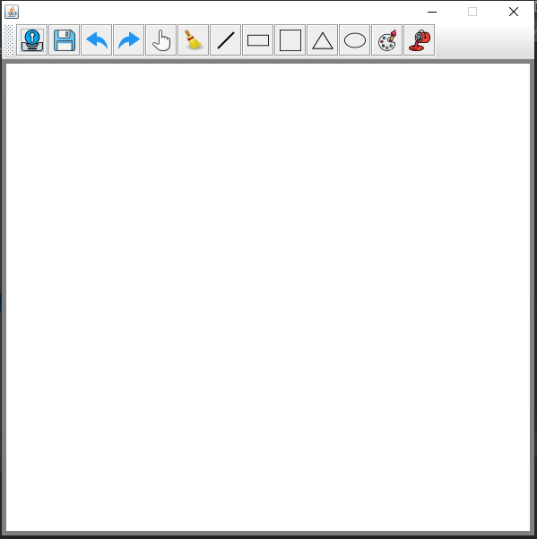
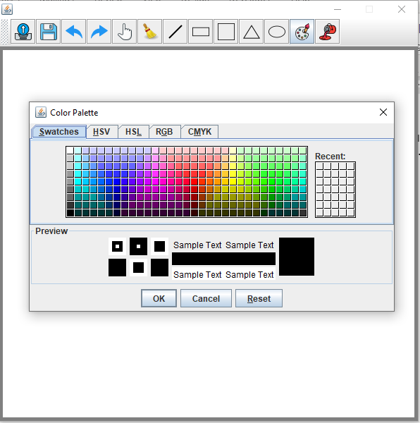
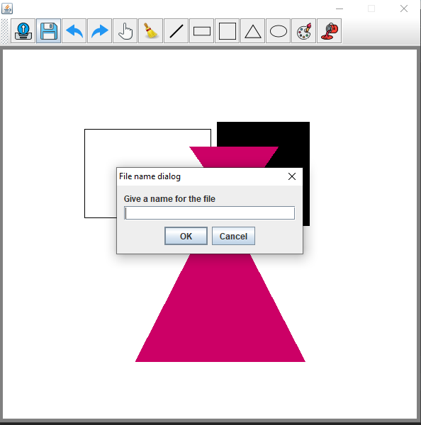
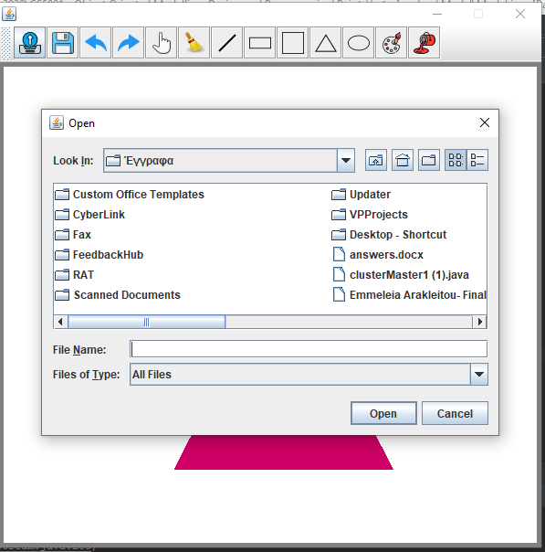

# Paint-Vector

This is a vector based drawing application made using Java Swing and AWT. The system is developed using the Model-Delegate (MD) design pattern, where the View and the Controller components are combined into a single element called "Delegate".

The Delegate component represents the Graphical User Interface (GUI), that users interact with in order to draw shapes on the canvas. The Delegate also incorporates the controller, that will translate the user inpur received by the interaction of the user with the GUI into the appropriate Model method calls. Based on the method that is called, the Model will be updated so that the required changes are applied. Finally, the model will inform the Model will notify the view about any changes that occured so that the state of the GUI is updated.

Another design pattern called Observers and Observable is used to establishe communication between the application components wihtout having the GUI constantly waiting for an update from the Model. The Observers (Delegate) is registered as one of the Observable’s (Model) Observers and whenever a change occurs in the Observable object, all its observers are informed about that change and based on that will update their state as needed.  To implement this functionality, I used a PropertyChangeSupport Object in the model named notified, extended the PropertyChangeListener Object in the Delegate and add the Delegate as an observer to the notified object.

The application supports the following shapes:a line, a rectangle, a square, a triangle and an ellipse, by choosing the shape he/she wished to draw from the toolbar and then by dragging the mouse on the white canvas. 

  

The user can also choose to change the color that is used to draw the shapes using color palette by clicking on the palette Icon
The user can choose to draw the shapes with or without filling by clicking at the bucket icon. 
Moreover, the user can select a shape using the select symbol, and then click on the shape he/she wishes to move and drag it across the drawing canvas.
Undo and redu actions are also available. The user can wipe the canvas entirely by clicking on broom icon. 

  

The use can save and load a drawing canvas. When the user chooses to save the canvas a popup window is displayed for the user to enter the name of the file to be saved. 

  

When the user wants to loads an existing file, a dialog box will appear to allow the user to navigate through the device directories and choose the file he/she wants to upload.

  

